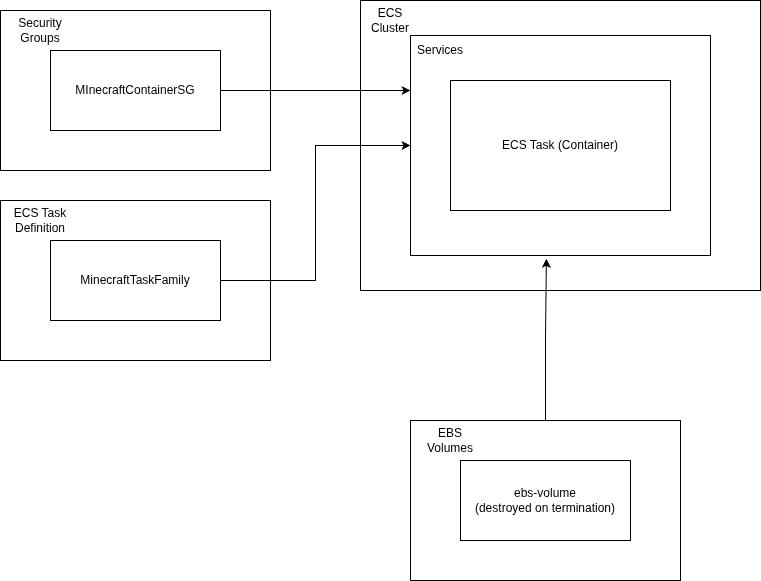
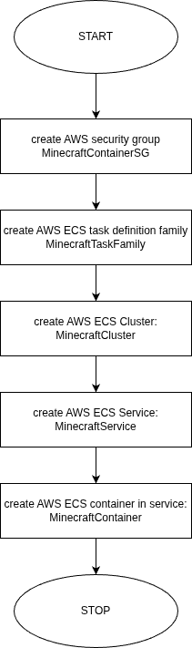

# Minecraft Deployment using ECS on AWS with Terraform

## Background

Minecraft is a widely played open-ended open-world sandbox game. While playing it locally by yourself is fun, it is possible to play it with friends in multiplayer mode. To do this, you will need a hosted Minecraft server. While several such public servers are available, it is possible to host your own server so that you can privately play with your friends.

This repository provides an IaC (Infrastructure as Code) script that enables you to host your very own Minecraft server on [Amazon AWS](https://aws.amazon.com). This IaC script is written using [Terraform](https://developer.hashicorp.com/terraform) a popular IaC tool. The below diagram illustrates the basic "deployment map."



The Terraform configuration file (script) will do the following:
1. It will first create a security group (`MinecraftSG`) that only allows incoming Minecraft connections
2. It will then define a task family for an ECS Service (`MinecraftTaskFamily`)
3. It will then create an ECS Cluster (`MinecraftCluster`)
4. It will then execute the task to create an ECS Service (`MinecraftService`) which starts a container (`MinecraftContainer`) while also attaching an EBS volume. This enables you to restart the service without losing data.

### Key AWS technologies

Key AWS technologies used:
- ECS (Elastic Container Service)
- EBS (Elastic Block Storage)

## A. Requirements

### A1. Pre-installed software

The following must be pre-installed and available on your system's `PATH`:
1. The `aws` CLI. [Follow the instructions by AWS here](https://docs.aws.amazon.com/cli/latest/userguide/getting-started-install.html)
2. Terraform. [Follow the instructions by Terraform here](https://developer.hashicorp.com/terraform/install)
3. It is recommended that you install `git` to clone this repository. You can however choose to download a ZIP from GitHub.

### A2. AWS Account

You must have an AWS account where you have access to the [`ECS Infrastructure Role`](https://docs.aws.amazon.com/AmazonECS/latest/developerguide/infrastructure_IAM_role.html). If you're using AWS Academy, then you should be able to use the provided `LabRole`. Once you have a functioning account please set the credentials using the `~/.aws/credentials` file (or `C:\Users\<USERNAME>\.aws\credentials` if on Windows).

```toml
[default]
aws_access_key_id=<access_key>
aws_secret_access_key=<secret_key>
aws_session_token=<session_token_if_applicable>
```

> NOTE: You may not need to set up `aws_session_token` if you're not using a AWS Academy account.

#### If not using AWS Academy

If you're not using AWS Academy, please update this block to the appropriate role:

**FROM**

```
data "aws_iam_role" "infra_role" {
  name = "LabRole"
}
```

**TO**

```
resource "aws_iam_role" "infra_role" {
  name = "ecs-ebs-mgmt-role"
  assume_role_policy = jsonencode({
    Version = "2012-10-17"
    Statement = [{
      Action    = "sts:AssumeRole"
      Effect    = "Allow"
      Principal = { Service = "://amazonaws.com" }
    }]
  })
}
resource "aws_iam_role_policy_attachment" "ebs_support" {
  role       = aws_iam_role.infra_role.name
  policy_arn = "arn:aws:iam::aws:policy/service-role/AmazonECSInfrastructureRolePolicyForVolumes"
}
```

### A3. Environment Variables

Make sure the following environment variables are set:

```sh
export AWS_DEFAULT_REGION=us-east-1
```

> NOTE: Replace with your region as is appropriate


## B. Instructions

```sh
# clone the repository (if cloning)
git clone https://github.com/ldsayan/minecraft-tf.git
# init
terraform init
# verify the terraform plan
terraform validate
# if all ok, run below. NOTE: you may have to interactively input "yes" to deploy
terraform apply
```

If all goes well, the script will output the public IP address of your minecraft instance which you can then connect to and invite others to play on.


## C. How to connect

1. Simply start the Minecraft launcher on your local machine
2. Click on play
3. Click on multiplayer
3. Click on add server
4. Enter the IP address that was shown as output earlier
5. You're ready to play

## Deployment sequence diagram

.

## License

This code is distributed under the [MIT License](./LICENSE).
